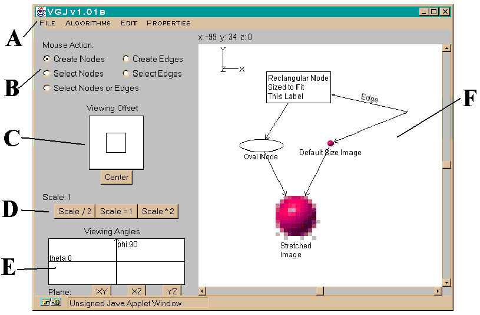

# vgjgraph
automatic graph layout in java grph editor  

VGJ, Visualizing Graphs with Java, is a tool for graph drawing and automatic graph layout.  
Graphs can be input into VGJ in two ways:  
with a textual description GML,  
or through a drawing the user creates using our graph editor.  
The user can then select an algorithm to layout the graph in an organized and (hopefully) aesthetically pleasing way.  
The current version is 1.03, released on 4/20/98.  
VGJ may be distributed under the terms of the GNU General Public License, Version 2.  

This is a java applet which may not run anymore in current web browsers.  

The source and java jar is in directory vgj  
The manual of this tool is in directory vgj/graph_drawing/manual  
The nodes can have url and images  
This tool uses a algorithm for laying out a graph by Clan-based Graph Deconposition.  
This tool include a spring embedder layout algorithm..
In directory examplealg is java source how to program with this graph library.  

because the layout algorithms are different this java source is extra interesting and it has a gml graph parser  

This is example gml graph data as input for vgj:  

graph [  
directed 1  
node [  
   id 0  
   label "Rectangular Node\nSized to Fit\nThis Label"  
   graphics [  
      Image [  
         Type "URL"  
         Location ""  
      ]  
      center [  
         x -36.0  
         y 128.0  
         z 0.0  
      ]  
      width 108.0  
      height 57.0  
      depth 46.0  
   ]  
   vgj [  
      labelPosition "in"  
      shape "Rectangle"  
   ]  
]  
node [  
   id 1  
   label "Stretched\nImage"  
   graphics [  
      Image [  
         Type "URL"  
         Location "red-ball.gif"  
      ]  
      center [  
         x -40.0  
         y -83.0  
         z 0.0  
      ]  
      width 80.0  
      height 80.0  
      depth 80.0  
   ]  
   vgj [  
      labelPosition "below"  
      shape "Oval"  
   ]  
]  
node [  
   id 2  
   label "Oval Node"  
   graphics [  
      Image [  
         Type "URL"  
         Location ""  
      ]  
      center [  
         x -97.0  
         y 33.0  
         z 0.0  
      ]  
      width 70.0  
      height 20.0  
      depth 20.0  
   ]  
   vgj [  
      labelPosition "below"  
      shape "Oval"  
   ]  
]  
node [  
   id 3  
   label "Default Size Image"  
   graphics [  
      Image [  
         Type "URL"  
         Location "red-ball.gif"  
      ]  
      center [  
         x 17.0  
         y 36.0  
         z 0.0  
      ]  
      width 12.0  
      height 12.0  
      depth 20.0  
   ]  
   vgj [  
      labelPosition "below"  
      shape "Oval"  
   ]  
]  
edge [  
   label "Edge"  
   source 0  
   target 3  
   graphics [  
      Point [  
         x 143.0  
         y 88.0  
         z 0.0  
      ]  
   ]  
]  
edge [  
   label ""  
   source 0  
   target 2  
   linestyle "dashed"  
]  
edge [  
   label ""  
   source 2  
   target 1  
]  
edge [  
   label ""  
   source 3  
   target 1  
]  
]  
  
